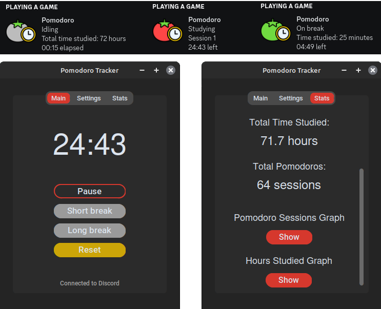
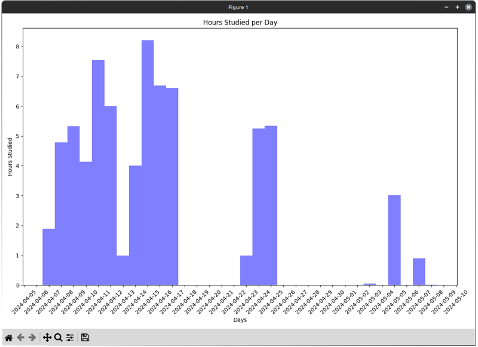

[](https://github.com/qwertyquerty/pypresence)


# Pomodoro Discord

Broadcast your study sessions.



## Running from Source

1. Clone the repository
    ```
    git clone https://github.com/jake158/pomodoro-discord.git
    ```

2. Go into the project directory and install the requirements
    ```
    cd pomodoro-discord
    pip install -r requirements.txt
    ```

3. Run simple tests (Ignore ResourceWarnings)
    ```
    python3 -m unittest discover tests`
    ```

4. Run
    ```
    python3 main.py
    ```

## Features

Adjusting all durations

Option to automatically cycle to a break after a session ends

Connecting and disconnecting Rich Presence by pressing "Connected to Discord" on the main tab

Tracks:
- Total time studied
- Time studied on each particular day
- Total pomodoro sessions
- Pomodoro sessions on each particular day


Matplotlib plots:



## Acknowledgements

Some themes adapted from: https://github.com/avalon60/ctk_theme_builder/tree/develop/user_themes

Current themes apart from the default one are pretty hideous but I will adjust them when I get to them.
